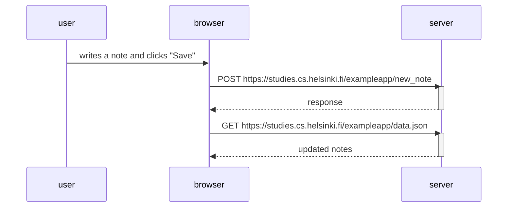

```mermaid
sequenceDiagram
    participant user
    participant browser
    participant server

    user->>browser: writes a note and clicks "Save"

    browser->>server: POST https://studies.cs.helsinki.fi/exampleapp/new_note
    activate server
    server-->>browser: response
    deactivate server

    browser->>server: GET https://studies.cs.helsinki.fi/exampleapp/data.json
    activate server
    server-->>browser: updated notes
    deactivate server
```
